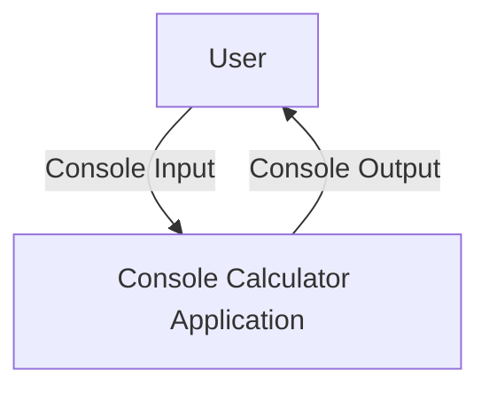
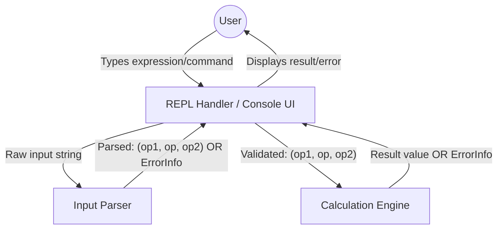

# Console Calculator - High-Level Design

## 1. Overview
This document outlines the High-Level Design (HLD) for a simple console-based calculator application implemented in Python. The application will function as a Read-Eval-Print Loop (REPL), allowing users to input basic arithmetic expressions in the format "number operator number", receive calculated results, and handle common errors gracefully. This HLD is based on the requirements detailed in the [Console Calculator - Main Specification](../../specifications/SPEC-MAIN-001_console_calculator_main_specification.md).

## 2. Architectural Goals
The primary architectural goals for the console calculator are:
*   **Modularity**: Design components with distinct responsibilities to ensure a clean separation of concerns, as mandated by project postulates.
*   **Testability**: Structure components and their interfaces to facilitate effective unit testing for core logic and edge cases.
*   **Clarity and Maintainability**: Produce a codebase that is easy to understand, modify, and extend.
*   **Correctness**: Ensure accurate calculation for supported operations and adherence to the specified input/output formats.
*   **Robust Error Handling**: Implement clear and user-friendly error messages for all specified error conditions.

## 3. System Context
The console calculator is a standalone command-line application. It interacts directly with the user via the console for input and output. There are no external system dependencies beyond the standard Python library.

## 4. Architectural Style
A **Component-Based Architecture** will be adopted. The system will be decomposed into logical components, each responsible for a specific aspect of the calculator's functionality (e.g., UI handling, input parsing, calculation). The overall flow will be managed by a REPL structure.

**Rationale**:
*   This style promotes modularity and separation of concerns, aligning with project postulates and NFR2.
*   Clearly defined components and interfaces enhance testability (NFR3).
*   It provides a simple and direct mapping from the application's requirements to its structure, suitable for the scale of this project.

## 5. Component Architecture

The application will consist of the following main components:

### 5.1. REPL Handler (ConsoleUI)
*   **Responsibilities**:
    *   Manages the main Read-Eval-Print Loop.
    *   Displays the input prompt (e.g., `calc> `).
    *   Reads raw user input from the console.
    *   Handles top-level commands like "exit" or "quit" (case-insensitive) to terminate the application.
    *   Orchestrates the flow by passing input to the `InputParser` and then to the `CalculationEngine`.
    *   Displays the final result or formatted error messages received from other components to the user.
*   **Interfaces**:
    *   Receives input string from the user.
    *   Sends input string to `InputParser`.
    *   Receives parsed data or error information from `InputParser`.
    *   Sends parsed data to `CalculationEngine`.
    *   Receives calculation result or error information from `CalculationEngine`.
    *   Outputs strings (results, errors, prompts) to the user console.

### 5.2. Input Parser
*   **Responsibilities**:
    *   Receives the raw input string from the `REPLHandler`.
    *   Trims leading/trailing whitespace.
    *   Validates the input format: must be "number operator number" (3 components after splitting by space).
    *   Attempts to convert the first and third components to numerical types (float).
    *   Validates the second component as one of the supported operators (+, -, *, /).
    *   Generates specific error messages for format violations, invalid numbers, or unsupported operators.
*   **Interfaces**:
    *   Receives raw input string from `REPLHandler`.
    *   Returns either:
        *   A structure/tuple containing the validated `operand1` (float), `operator` (string), and `operand2` (float).
        *   An error structure/object indicating parsing failure, including a user-friendly error message (e.g., `{has_error: true, message: "Error: Invalid input format."}`).

### 5.3. Calculation Engine
*   **Responsibilities**:
    *   Receives validated numerical operands and the operator string from the `REPLHandler` (after successful parsing by `InputParser`).
    *   Performs the specified arithmetic operation (+, -, *, /).
    *   Handles calculation-specific errors, primarily division by zero.
    *   Generates a specific error message for division by zero.
*   **Interfaces**:
    *   Receives `operand1` (float), `operator` (string), `operand2` (float).
    *   Returns either:
        *   The calculated numerical result (float).
        *   An error structure/object indicating calculation failure, including a user-friendly error message (e.g., `{has_error: true, message: "Error: Division by zero is not allowed."}`).

## 6. Data Architecture
*   **Input Expression (parsed)**:
    *   `operand1`: Float
    *   `operator`: String (one of "+", "-", "*", "/")
    *   `operand2`: Float
*   **Calculation Result**:
    *   `value`: Float
*   **Error Information (conceptual)**:
    *   A structure returned by `InputParser` or `CalculationEngine` upon error, typically containing:
        *   `has_error`: Boolean (True)
        *   `error_message`: String (User-friendly message)
*   **Data Storage**: No persistent data storage is required for this application. All data is transient and processed per REPL cycle.

## 7. Integration Architecture
Not applicable. The application is a standalone console program with no external system integrations.

## 8. Deployment Architecture
*   **Model**: The application will be deployed as a Python script (or a collection of scripts/modules).
*   **Infrastructure**: Requires a Python 3.x runtime environment. No other specific infrastructure is needed.
*   **Environment**: Console-based execution.

## 9. Cross-Cutting Concerns
*   **Error Handling**:
    *   Errors are detected by the component responsible for the specific validation or operation (e.g., `InputParser` for format errors, `CalculationEngine` for division by zero).
    *   Components detecting errors are responsible for generating a structured error response, including a user-friendly message, as defined in the specification.
    *   The `REPLHandler` is responsible for displaying these error messages to the user.
*   **Input Validation**:
    *   Performed comprehensively by the `InputParser` component. This includes format, type, and operator validation.
    *   The `CalculationEngine` relies on pre-validated input for operations, only checking for calculation-specific issues like division by zero.

## 10. Technology Stack
*   **Programming Language**: Python (version 3.x, as per NFR1).
*   **Libraries**: Only the Python standard library. No external libraries are required for core functionality.

## 11. Architectural Decisions
*   **Component-Based Design**: Chosen for modularity, testability, and clear separation of concerns, aligning with project postulates.
*   **Distributed Error Message Generation**: Components (`InputParser`, `CalculationEngine`) will generate their specific error messages. The `REPLHandler` will display them. This simplifies the design for V1 by avoiding a complex central error handling component while still providing clear, context-specific error details.
*   **Input Validation Centralization**: All initial input validation (format, type, operator) is centralized within the `InputParser`. This ensures that the `CalculationEngine` receives data it can largely trust, simplifying its logic.
*   **Direct Flow Control by REPLHandler**: The `REPLHandler` explicitly calls `InputParser` and then `CalculationEngine`, managing the sequence of operations.

## 12. Risks and Mitigations
*   **Risk**: Ambiguity in parsing edge-case inputs (e.g., multiple spaces between tokens, varied number formats).
    *   **Mitigation**: The `InputParser` will implement robust trimming of input strings. The specification's "number operator number" format, split by single spaces after normalization, will be strictly enforced. Standard float conversion will handle typical number formats.
*   **Risk**: Tight coupling if components are not designed with clear interfaces.
    *   **Mitigation**: Define clear, minimal interfaces for each component, focusing on data transfer (parsed input, results, error structures). Adherence to these interfaces will be crucial during LLD and implementation.

## 13. Future Considerations
While out of scope for the current version, future enhancements could include:
*   **History**: A `HistoryManager` component could be introduced to store and retrieve past calculations.
*   **Order of Operations**: Would require a more sophisticated `InputParser` (e.g., using Shunting-yard algorithm or similar to produce an Abstract Syntax Tree) and a `CalculationEngine` capable of evaluating expressions with precedence.
*   **Extended Operations**: Adding more functions would primarily impact the `InputParser` (to recognize new operators/functions) and `CalculationEngine` (to implement the logic).
*   **Configuration**: A `ConfigManager` could handle settings like prompt style or precision.