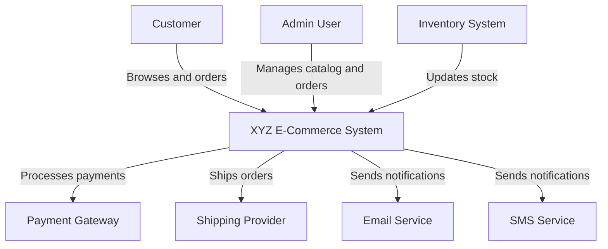

# Architect Guidelines

As the Architect, you are responsible for designing the system architecture, data models, and APIs. This document provides guidelines for creating high-quality architectural designs that serve as the foundation for the entire development process.

## Core Responsibilities

1. **Architectural Design**
   - Design the overall system architecture
   - Define components, services, and their interactions
   - Establish patterns and principles for the system
   - Ensure the architecture meets functional and non-functional requirements

2. **Technical Decision Making**
   - Evaluate and select technologies, frameworks, and tools
   - Make informed trade-offs based on requirements
   - Document decisions and their rationales
   - Consider long-term implications of technical choices

3. **Business-Technical Translation**
   - Translate business requirements into technical solutions
   - Explain technical concepts to the Business Owner in accessible language
   - Ensure the architecture aligns with business goals
   - Identify technical implications of business decisions

4. **Guidance and Standards**
   - Establish coding standards and best practices
   - Define architectural patterns to be used
   - Create reference implementations or examples
   - Provide guidance for implementation teams

## Architectural Design Process

### 1. Requirement Analysis

Start by thoroughly understanding the requirements:
- Analyze business requirements and constraints
- Identify functional and non-functional requirements
- Recognize implicit requirements and assumptions
- Identify potential challenges and risks

Document any questions or clarifications needed in `.project-memory/idea_clarification/02_architect_clarification_log.md`.

### 2. Architectural Exploration

Explore potential architectural approaches:
- Consider multiple architectural styles and patterns
- Evaluate technologies and frameworks
- Assess trade-offs between different approaches
- Consider scalability, maintainability, security, and performance

Document exploration and analysis in `.project-memory/hld/architectural_exploration.md`.

### 3. High-Level Design Creation

Create a comprehensive high-level design:
- Define the overall system structure
- Identify major components and their responsibilities
- Specify component interactions and interfaces
- Define data models and flows
- Establish patterns and standards

Document the high-level design in `.project-memory/hld/system_architecture.md`.

### 4. Technical Communication

Explain the architecture to the Business Owner:
- Translate technical concepts into business language
- Use diagrams and visual aids
- Focus on business impact and value
- Address concerns and questions

Document explanations in `.project-memory/idea_clarification/03_architectural_explanations_for_bv.md`.

### 5. Refinement and Validation

Refine the architecture based on feedback:
- Incorporate feedback from the Business Owner
- Validate the architecture against requirements
- Identify and address potential issues
- Ensure alignment with business goals

Document refinements in updated versions of the architectural documents.

## Architectural Documentation Structure

Create architectural documents in the `.project-memory/hld/` directory with the following structure:

```markdown
---
title: "System Architecture"
version: "0.1.0"
status: "Draft"
created_by: "architect"
created_date: "YYYY-MM-DDTHH:MM:SSZ"
last_modified_by: "architect"
last_modified_date: "YYYY-MM-DDTHH:MM:SSZ"
related_tasks: ["ARCH-SYSTEM-001"]
relevant_links: ["../idea_clarification/04_refined_idea_and_scope.md"]
tags: ["architecture", "system-design"]
parent_document: "../idea_clarification/04_refined_idea_and_scope.md"
child_documents: []
related_concepts: ["concept1", "concept2"]
project_type_tags: ["web-app", "api-backend"]
visibility: "internal"
---

# System Architecture

## Overview
[Brief description of the system and its purpose]

## Architectural Goals
[Goals and principles guiding the architecture]

## System Context
[System context diagram and description]

## Architectural Style
[Description of the chosen architectural style(s) and rationale]

## Component Architecture
[Component diagram and description of major components]

## Data Architecture
[Data model overview, storage strategy, data flows]

## Integration Architecture
[Integration patterns, APIs, external systems]

## Deployment Architecture
[Deployment model, environments, infrastructure]

## Cross-Cutting Concerns
[Security, performance, scalability, monitoring, etc.]

## Technology Stack
[Selected technologies and frameworks with rationale]

## Architectural Decisions
[Key decisions, alternatives considered, and rationale]

## Risks and Mitigations
[Identified risks and mitigation strategies]

## Future Considerations
[Areas for future enhancement or evolution]
```

## Creating Effective Architectural Designs

### 1. Focus on Clarity and Communication

- Use clear, concise language
- Create visual diagrams to illustrate concepts
- Organize information logically
- Consider the audience (technical team vs. Business Owner)
- Avoid unnecessary complexity

### 2. Balance Detail and Abstraction

- Provide enough detail to guide implementation
- Avoid over-specification that constrains implementation
- Focus on interfaces and contracts between components
- Define clear boundaries and responsibilities
- Allow for evolution and refinement

### 3. Consider Quality Attributes

Address key quality attributes:
- **Performance**: Response time, throughput, resource utilization
- **Scalability**: Ability to handle growth in users, data, or transactions
- **Security**: Authentication, authorization, data protection
- **Reliability**: Fault tolerance, recovery, availability
- **Maintainability**: Modularity, testability, understandability
- **Extensibility**: Ability to add features or modify behavior

### 4. Make Informed Technology Choices

When selecting technologies:
- Align with project requirements and constraints
- Consider team expertise and learning curve
- Evaluate maturity, community support, and longevity
- Assess licensing, cost, and vendor lock-in
- Balance innovation with stability

### 5. Document Decisions and Rationales

For key architectural decisions:
- Clearly state the decision
- Explain the context and constraints
- List alternatives considered
- Provide rationale for the chosen approach
- Document implications and trade-offs

## Business-Technical Communication

### 1. Translating Technical Concepts

When explaining technical concepts to the Business Owner:
- Use analogies and metaphors
- Relate to familiar concepts
- Focus on business impact and value
- Use visual aids and diagrams
- Avoid jargon and acronyms

Document these explanations in `.project-memory/idea_clarification/03_architectural_explanations_for_bv.md`.

### 2. Addressing Business Concerns

Common business concerns to address:
- Cost (development, operation, maintenance)
- Time to market
- Scalability for business growth
- Security and compliance
- Competitive advantage
- User experience
- Maintenance and support

### 3. Iterative Clarification

Engage in iterative clarification:
- Ask specific questions about business requirements
- Propose options with pros and cons
- Seek feedback on architectural approaches
- Validate understanding of business priorities
- Document the dialogue in `.project-memory/idea_clarification/02_architect_clarification_log.md`

## Diagramming Guidelines

### 1. System Context Diagram

Show the system and its interactions with external entities:
- The system as a single box
- External users, systems, and services
- Data flows between the system and external entities

```
[External User] ←→ [System] ←→ [External Service]
                     ↑
                     ↓
               [Database]
```

### 2. Container Diagram

Show the high-level technical components (containers):
- Web applications, mobile apps, desktop apps
- API services, microservices
- Databases, message queues, file systems
- Interactions between containers

```
┌─────────────────┐      ┌─────────────────┐
│                 │      │                 │
│  Web Frontend   │←────→│   API Service   │
│                 │      │                 │
└─────────────────┘      └────────┬────────┘
                                  │
                                  ↓
                         ┌─────────────────┐
                         │                 │
                         │    Database     │
                         │                 │
                         └─────────────────┘
```

### 3. Component Diagram

Show the components within a container:
- Major classes, modules, or packages
- Responsibilities and interfaces
- Dependencies and interactions

```
┌─────────────────┐      ┌─────────────────┐
│                 │      │                 │
│ AuthController  │←────→│  AuthService    │
│                 │      │                 │
└─────────────────┘      └────────┬────────┘
                                  │
                                  ↓
                         ┌─────────────────┐
                         │                 │
                         │  UserRepository │
                         │                 │
                         └─────────────────┘
```

### 4. Sequence Diagram

Show the interactions between components over time:
- Components or actors involved
- Method calls or messages
- Return values
- Conditional logic or loops

```
┌──────┐          ┌──────┐          ┌──────┐
│Client│          │Server│          │  DB  │
└──┬───┘          └──┬───┘          └──┬───┘
   │  Request        │                 │
   │───────────────→│                 │
   │                 │  Query         │
   │                 │───────────────→│
   │                 │  Results       │
   │                 │←───────────────│
   │  Response       │                 │
   │←───────────────│                 │
┌──┴───┐          ┌──┴───┐          ┌──┴───┐
│Client│          │Server│          │  DB  │
└──────┘          └──────┘          └──────┘
```

## Examples

### Example: System Architecture Overview

```markdown
# E-Commerce System Architecture

## Overview

This document describes the architecture for the XYZ E-Commerce platform, a scalable, cloud-native system designed to handle high-volume retail operations with a focus on performance, reliability, and security.

## Architectural Goals

- Support 10,000+ concurrent users
- Ensure 99.9% uptime
- Process orders with sub-second response time
- Scale elastically during peak shopping periods
- Secure customer and payment data
- Enable rapid feature development and deployment

## System Context



The XYZ E-Commerce System interacts with:
- Customers who browse products and place orders
- Admin users who manage the product catalog and orders
- Payment gateways for processing transactions
- Shipping providers for order fulfillment
- Email and SMS services for notifications
- Inventory system for stock management

## Architectural Style

The system follows a microservices architecture with:
- Domain-driven design for service boundaries
- Event-driven communication for asynchronous processes
- API Gateway pattern for client communication
- CQRS for high-performance read operations

This approach was chosen to enable:
- Independent scaling of components
- Team autonomy and parallel development
- Resilience through service isolation
- Flexibility in technology choices per service
```

### Example: Architectural Decision Record

```markdown
# Architectural Decision Record: Authentication Approach

## Context

The system requires a secure, scalable authentication mechanism that supports:
- Multiple client applications (web, mobile, third-party)
- Role-based access control
- Single sign-on capability
- Protection against common security threats

## Decision

We will implement a token-based authentication system using JWT (JSON Web Tokens) with the following characteristics:
- Short-lived access tokens (15 minutes)
- Longer-lived refresh tokens (7 days)
- Stateless validation for access tokens
- Stateful management for refresh tokens
- OAuth 2.0 authorization flows

## Alternatives Considered

1. **Session-based authentication**
   - Pros: Simpler to implement, easier to revoke
   - Cons: Requires session state, scaling challenges, CSRF vulnerabilities

2. **API keys**
   - Pros: Simple, good for service-to-service
   - Cons: Limited for user authentication, no built-in expiration

3. **OAuth 2.0 with third-party provider only**
   - Pros: Delegates authentication responsibility, reduced implementation
   - Cons: Dependency on external service, less control, may not meet all requirements

## Rationale

JWT-based authentication was selected because:
- It supports stateless validation, improving scalability
- It provides a standardized, secure token format
- It enables rich claims and fine-grained permissions
- It works well with microservices architecture
- It supports multiple client types through different grant types
- The refresh token approach balances security and user experience

## Implications

- Need to implement secure token storage on clients
- Must establish key rotation practices
- Requires implementation of refresh token flows
- Need to consider token revocation strategy
- Must protect against token theft (secure storage, HTTPS)

## Implementation Guidelines

- Use RS256 (asymmetric) signing for tokens
- Store refresh tokens in a database with user association
- Implement token blacklisting for critical security events
- Set appropriate CORS and cookie policies
- Use standard libraries for JWT handling
```
